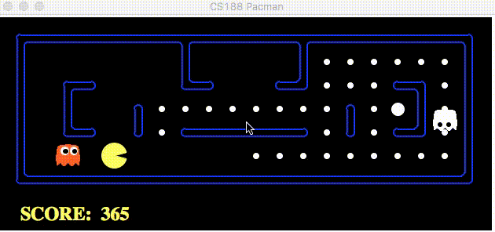

# Jasmine Boonyakiti Portfolio

<h1><b>1. Flags 300</b></h1>

I worked on this project for my Introduction to Data Mining (CMPT 300B) class at Westminster College. This final project consisted of working with Python to create graphical visualizations of the Flag data that we had collected. We ran a couple models (Decision Tree, Gradient Boost, SVM, Random Forest, and K-Nearest Neighbor) to see what was the best model for our data, and 5 visualizations (Bokeh, Plotly, Matplotlib, and Seaborn). Since there were groups of 2-4 people, we had to rely on one another for each part that they would contribute. The significance of this project had helped with collaboration amongst peers with a project that had little guidance on how to turn our flag data into useful information. This project represents the Computer Science program goals and College Wide Learning Goals because this project had us collaborate with our group along with work individually. We also had to take a day to research and make sure that our data was going to provide statistical data that could be used, along with researching which data plotting graphs would best demonstrate our data we collected.

<h1><b>2. Movie Database </b></h1>

I worked on this project for my Database Systems (CMPT 307) class at Westminster College. During the final stretch of the semester, we focused on creating a database that would be used to store movie information, ticket information, and reviews of that movie while having a user friendly GUI to work with. Like the project above, this project consisted of 2-4 people working on a project. Every Wednesday, our groups would give a status update on our individual projects while getting feedback from our professor and peers on what could be improved. Since we were all pretty new to creating websites, we ended up having a learning curve with developing with Angular JS, HTML5, MySQL and Bootstrap.

This project represents the Computer Science program goals because we had to understand how to securely and properly collect information from a database while also having a user friendly front-end. This would include being able to save information to the database, pull the information, and display it in a way that made sense. There was also collaboration that also falls under the College Wide Learning Goals and the Computer Science goals. We also had to be creative in how we set up our website so that it would stand out from other projects. 

<h1><b>3. PacMan MultiAgent </b></h1>

<h1><b>4. Shaded Sphere </b></h1>

<h1><b>5. </b></h1>

<h1><b>6. Final Project </b></h1>
