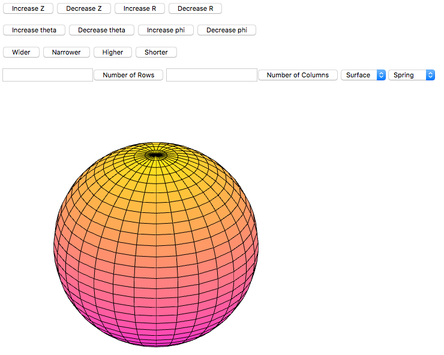

# Jasmine Boonyakiti Portfolio

<h1><b>1. Flags 300</b></h1>

I worked on this project for my Introduction to Data Mining (CMPT 300B) class at Westminster College. This final project consisted of working with Python to create graphical visualizations of the Flag data that we had collected. We ran a couple models (Decision Tree, Gradient Boost, SVM, Random Forest, and K-Nearest Neighbor) to see what was the best model for our data, and 5 visualizations (Bokeh, Plotly, Matplotlib, and Seaborn). Since there were groups of 2-4 people, we had to rely on one another for each part that they would contribute. The significance of this project had helped with collaboration amongst peers with a project that had little guidance on how to turn our flag data into useful information. 

This project represents the Computer Science program goals and College Wide Learning Goals because this project had us collaborate with our group along with work individually. We also had to take a day to research and make sure that our data was going to provide statistical data that could be used, along with researching which data plotting graphs would best demonstrate our data we collected.This project represents the College Wide Learning Goals because our team had good communication throughout the whole project and when there was a situation where we got stuck, someone else was able to help out. 

<h1><b>2. Movie Database </b></h1>

I worked on this project for my Database Systems (CMPT 307) class at Westminster College. During the final stretch of the semester, we focused on creating a database that would be used to store movie information, ticket information, and reviews of that movie while having a user friendly GUI to work with. Like the project above, this project consisted of 2-4 people working on a project. Every Wednesday, our groups would give a status update on our individual projects while getting feedback from our professor and peers on what could be improved. Since we were all pretty new to creating websites, we ended up having a learning curve with developing with Angular JS, HTML5, MySQL and Bootstrap.

This project represents the Computer Science program goals because we had to understand how to securely and properly collect information from a database while also having a user friendly front-end. This would include being able to save information to the database, pull the information, and display it in a way that made sense. There was also collaboration that also falls under the College Wide Learning Goals and the Computer Science goals. We also had to be creative in how we set up our website so that it would stand out from other projects. 

<h1><b>3. PacMan MultiAgent </b></h1>

I worked on this project for my Artificial Intelligence (CMPT 301) class at Westminster College. Throughout this whole semester, we focused on learning the different AI algorithms. We had to demonstrate our understanding of these algorithms by working on the PacMan projects. The first function that I developed was the evaluation function. This function is supposed to take in both the food location and the ghost location compared to pac-man. In my code, I added a couple variables so that certain steps could be tracked easier. Which I then have two for loops that check for the ghost position and the food positions in the game. At the end I then have a variable called result that gets the score from each game by adding the score plus the food left and then subtracts the ghost distance. The only difference between 1 and 5 is that the result has the sum of newScaredTimes is added to the other three values.
	
The minimax values get worse when the depth is increased because it uses bfs as a search through each node which causes it to take up more space and will have it report a larger penalty. As the depths go up the large the penalties become for my MinimaxAgent. The expectimax agent will win about half the time because it is based on the probability of the ghost going the other direction. Whereas, the alpha beta pruning will lose all the time because that is the best course of action to take. It instantly will gravitate towards ending the game so that there is less of a penalty to take by dying right away. 

This project represents the Computer Science program goals because I gained significant project experience working individually on this assignment. With implementing the algorithms for question 2-4, I didn't realize I had to implement each of the min and max values as definitions. After I had gotten that hint it made it so much easier. I also just was able to copy the functions that I had done for the minimax algorithm and pasted them into the other algorithms and make minimal tweaks to them in order to get the others up and running. Also I did the same thing for 1 and 5 in order to make sure that 5 was going to work properly. Overall the assignment wasn't too bad after I had gotten the hint for the middle questions. This also meets the critical thinking College Wide Learning Goal because in order to turn this project in, I had to include a README that made me think about the code I was implementing and not just turning in an assignment. It included questions about what was challenging, and questions specifically about the methods themselves.

<h1><b>4. Shaded Sphere </b></h1>

I worked on this project for my Computer Graphics (CMPT 360) class at Westminster College. Throughout the class we worked with WebGL and JavaScript to render our 2D and 3D graphics. On this project, I worked with a partner to render a shaded scene as seen above. 

<h1><b>5. </b></h1>

<h1><b>6. Final Project </b></h1>
